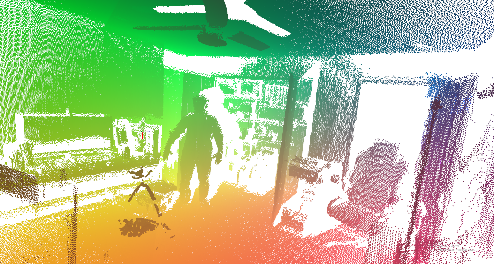

# LEO - Lidar Exploration Operator

## Links:
Project Tracker -> https://trello.com/b/2UjWfTOU/leo
Research Paper -> (IN Progress) 
## ===========================================

## Abstract

This research presents a low-cost approach for constructing a semantically rich 3D point-based representation of rough or unstructured environments. The proposed method integrates data from a 2D LiDAR and a camera system to capture both geometric and visual information, enabling accurate scene reconstruction and interpretation without relying on expensive 3D sensors. By combining these complementary modalities, the system efficiently generates detailed spatial maps that can support applications such as navigation, environment modeling, and object recognition in cost-sensitive settings.

## Introduction

* In Progress

## Tools and Resources

* In Progress

## Density Comparison 

* In Progress

## Iterative Closest Point

* In Progress

## Future of LEO 

* In Progress

## References 

https://doi.org/10.3390/app132312741 

https://learnopencv.com/iterative-closest-point-icp-explained/ 

https://www.sciencedirect.com/science/article/pii/S0957417422010156?via%3Dihub 

https://www.cvl.iis.u-tokyo.ac.jp/class2017/2017w/papers/5.3DdataProcessing/20080109_05_Nuchter_Cached_k-dtree_3DIM2007.pdf"

https://www.mdpi.com/1424-8220/18/2/497 

https://dlib.scu.ac.ir/bitstream/Hannan/256026/1/9781482243017.pdf 

