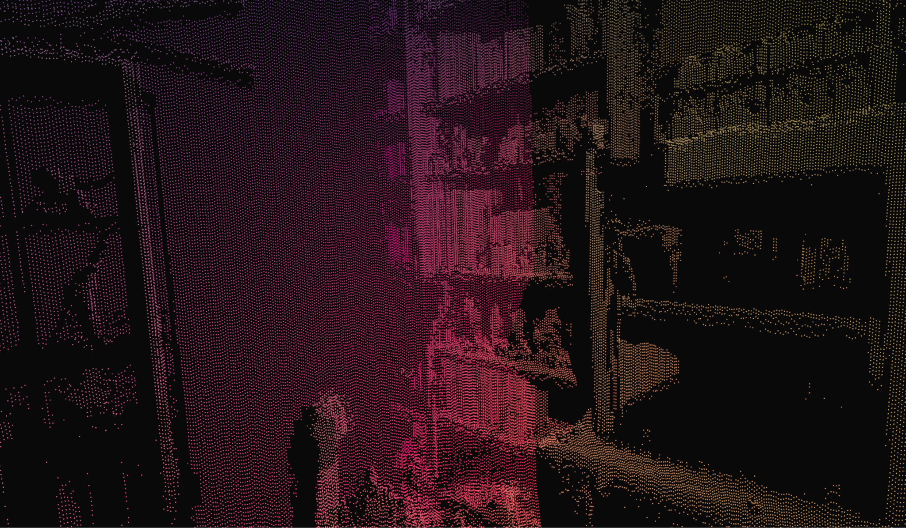
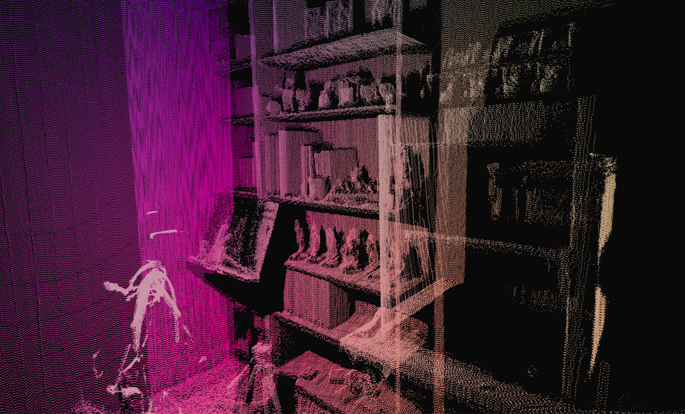

# LEO - Lidar Exploration Operator

## Links:
Project Tracker -> https://trello.com/b/2UjWfTOU/leo
Research Paper -> (IN Progress) 
## ===========================================

## Abstract

This research presents a low-cost approach for constructing a semantically rich 3D point-based representation of rough or unstructured environments. The proposed method integrates data from a 2D LiDAR and a camera system to capture both geometric and visual information, enabling accurate scene reconstruction and interpretation without relying on expensive 3D sensors. By combining these complementary modalities, the system efficiently generates detailed spatial maps that can support applications such as navigation, environment modeling, and object recognition in cost-sensitive settings.

## Introduction

Reliable 3D mapping is essential for tasks such as navigation, exploration, and scene understanding, yet the hardware required to produce accurate spatial data is often prohibitively expensive. Many low-cost platforms rely on simpler sensors, which limits their ability to model complex or unstructured environments. To address this gap, we investigate a method that combines 2D LiDAR and camera data to build effective 3D representations while maintaining affordability and practicality.

## Tools and Resources

## Density Comparison 

  
  

After achieving 3D scanning using the 2D LiDAR, we shifted our focus to increasing point density in the scene to eliminate the gaps between YZ-planes. Initially, we captured about 200,000 points at 1.0° per step, but we aimed for higher resolution. By reducing the step size to 0.25°, we collected approximately 900,000 coordinate points. Using micro-stepping, we further improved the angular resolution to 0.1125°, resulting in a high-resolution point-cloud scan. However, this increased precision came with trade-offs: significantly longer computation times due to the larger dataset, as well as longer physical scan durations because of the greater number of required iterations.

## Iterative Closest Point

* In Progress

## Future of LEO 

* In Progress

## References 

* https://doi.org/10.3390/app132312741 

* https://learnopencv.com/iterative-closest-point-icp-explained/ 

* https://www.sciencedirect.com/science/article/pii/S0957417422010156?via%3Dihub 

* https://www.cvl.iis.u-tokyo.ac.jp/class2017/2017w/papers/5.3DdataProcessing/20080109_05_Nuchter_Cached_k-dtree_3DIM2007.pdf"

* https://www.mdpi.com/1424-8220/18/2/497 

* https://dlib.scu.ac.ir/bitstream/Hannan/256026/1/9781482243017.pdf 

